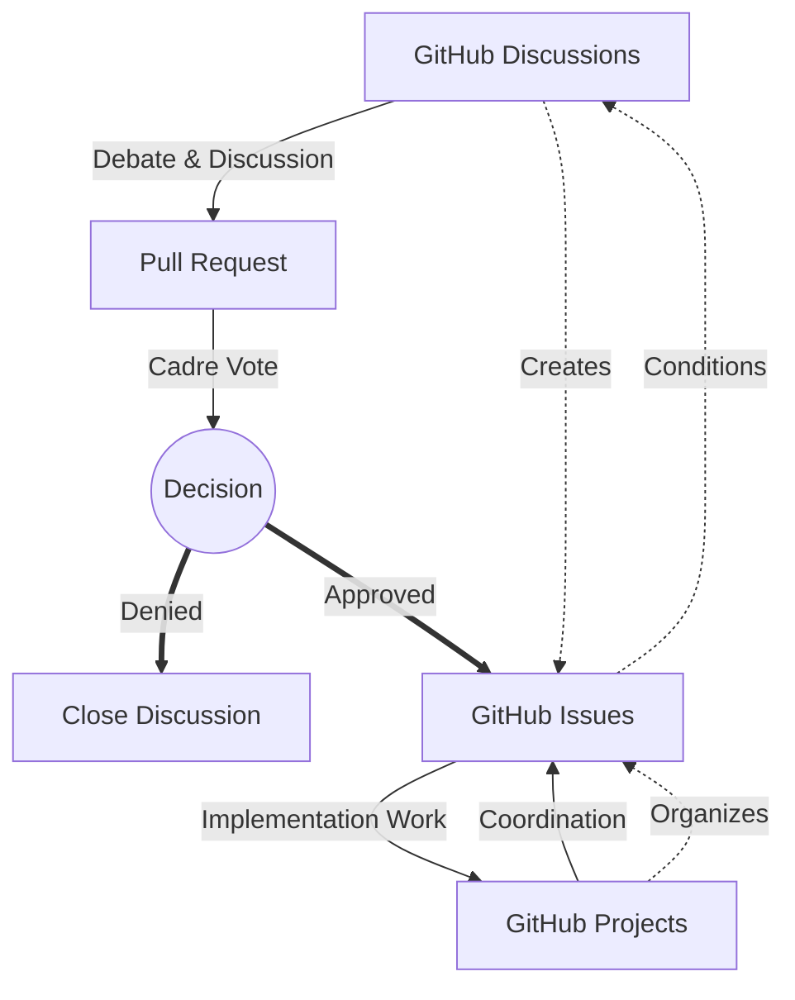

# KSBC .github Repository

This repository houses the core components of the DRUIDS system, including:
- Obsidian vault configurations and content structure.
- Documentation templates and content.
- Workflow automation scripts.
- Guidelines for content creation, security, and collaboration.

The aim is to provide a secure, efficient, and ideologically coherent system for managing the KSBC's collective knowledge and operational documentation.

## Democratic Centralist Principles in DRUIDS

The DRUIDS system is designed to embody and support the democratic centralist principles of the KSBC.

### Core Principles Implementation

1. **Freedom of Discussion, Unity of Action**
   - GitHub Discussions and Issues enable thorough democratic debate
   - Pull Request reviews ensure collective input on proposals  
   - Once merged to `main`, decisions are binding and implemented uniformly
   - Workflow automations enforce organizational decisions consistently

2. **Subordination of Minority to Majority**
   - Voting mechanisms in PR reviews and issue discussions
   - Minority positions are recorded but majority decisions are executed
   - Automated workflows implement decisions regardless of individual preferences

3. **Lower Bodies Subordinate to Higher Bodies**
   - Repository permissions reflect organizational hierarchy
   - CODEOWNERS enforces committee review requirements
   - Security classifications prevent unauthorized access to higher-level decisions

4. **Theory → Plan → Practice → Summation Cycle**
   - Issue templates guide theoretical development (Study Guides)
   - Project boards track planning and implementation phases
   - Report templates capture practice outcomes
   - CSC templates enable systematic summation and improvement

### Security as Revolutionary Discipline

- Three-tier classification (L0/L1/L2) implements need-to-know principles
- Automated security validation prevents information leaks
- Secure routing of reports maintains operational security
- GPG signing and encryption protect sensitive communications

### Mass Line Integration

- Mass conditions reports flow from sympathizers to cadre analysis
- Automated processing preserves security while enabling synthesis
- Public education materials return processed knowledge to masses
- Bi-weekly study sessions build mass revolutionary consciousness

### Criticism and Self-Criticism Automation

- CSC report templates standardize the practice
- Issue tracking ensures commitments are followed through
- Project boards visualize progress on self-improvement
- Historical archives enable pattern recognition and growth

## Repository Structure Overview

- **/content**: Contains the main documentation and content, organized by security tiers:
    - `content/L0_public/`: Publicly accessible materials.
    - `content/L1_candidate/`: Materials for candidates and administrative functions.
    - `content/L2_cadre/`: Restricted materials for cadre members.
- **/.github**: Contains issue templates, pull request templates, and (eventually) GitHub Actions workflows.
- **/.obsidian**: (To be created) Will contain Obsidian-specific configuration files for vault setup, plugins, themes, etc.
- **/templates**: (To be created) Will house document templates for use with Obsidian's Templater plugin.
- `OBSIDIAN_INTEGRATION_GUIDE.md`: Comprehensive guide for setting up and using Obsidian with this system.

### Directory Mapping

```text
.github/
├── ISSUE_TEMPLATE/
│   ├── config.yml                              # Issue template configuration
│   ├── campaign-plan.yml                       # Campaign planning template
│   ├── cadre-work-report.yml                   # Cadre work reporting
│   ├── criticism-self-criticism-report.yml     # CSC session documentation
│   ├── evaluation-framework.yml                # Evaluation templates
│   ├── implementation-plan.yml                 # Implementation planning
│   ├── implementation-task.yml                 # Task tracking
│   ├── mass-conditions-report.yml              # Mass conditions reporting
│   ├── poliitical-education.yml               # Political education planning
│   ├── security-incident-report.yml            # Security incident reporting
│   ├── study-guide.yml                         # Study guide creation
│   ├── study-session-announcement.yml          # Session announcements
│   └── timeline.yml                            # Timeline planning
│
├── PULL_REQUEST_TEMPLATE/
│   └── (templates for PR workflows)
│
├── workflows/
│   ├── education/
│   │   ├── schedule-study-sessions.yml         # Bi-weekly session scheduling
│   │   └── study-session-reminder.yml          # Automated reminders
│   ├── reports/
│   │   ├── process-mass-report.yml             # Mass report processing
│   │   ├── process-cadre-report.yml            # Cadre report processing
│   │   └── security-classification.yml         # Security validation
│   ├── create-proposal-branch.yml              # Democratic proposal branching
│   ├── decision-implementation.yml             # Decision tracking
│   ├── issue-management.yml                    # Issue automation
│   ├── security-validation.yml                 # Security checks
│   └── (other workflow files)
│
├── CODEOWNERS                                  # Defines ownership for democratic review
├── CODE_OF_CONDUCT.md                          # Organizational code of conduct
├── CONTRIBUTING.md                             # Detailed contribution guidelines
├── GOVERNANCE.md                               # Democratic centralist governance model
├── SECURITY.md                                 # Security classification information
│
├── profile/                                    # Organization profile
│   └── README.md                               # Organization profile README (public)
│
├── documentation/                              # Additional documentation
│   └── dataview_examples/                      # Dataview query examples
│
└── README.md                                   # Main repository README
```

### GitHub Projects Board

+-------------------+---------------+----------------+------------------+
| Democratic        | Decision      | Unity of       | Evaluation       |
| Discussion        | Making        | Action         |                  |
+-------------------+---------------+----------------+------------------+
| • Theory debates  | • Consensus   | • Tasks being  | • Completed work |
| • Study materials | formation     | implemented    | • CSC process    |
| • Investigations  | • Voting      | • Assignments  | • Lessons learned|
+-------------------+---------------+----------------+------------------+

### WORKFLOW



## Getting Started

### Quick Setup

1. **Clone the repository:** 
   ```bash
   git clone https://github.com/ks-sbc/.github.git
   cd .github
   ```

2. **Enable GitHub Actions:**
   - Go to Settings → Actions → General
   - Enable "Allow all actions and reusable workflows"
   - Save changes

3. **Configure Teams (Organization Admins):**
   - Create teams: `cadre`, `education-committee`, `security-committee`
   - Assign appropriate members to each team
   - Set repository permissions based on security levels

4. **Set up Secrets:**
   - Add `REPO_ACCESS_TOKEN` for cross-repository operations
   - Configure GPG keys for encrypted reports (optional)

### For Contributors

1. **Review Documentation:**
   - Start with [CONTRIBUTING.md](CONTRIBUTING.md) for contribution guidelines
   - Read [SECURITY.md](SECURITY.md) to understand classification levels
   - Check [CODE_OF_CONDUCT.md](CODE_OF_CONDUCT.md) for community standards

2. **Submitting Reports:**
   - Use Issues → New Issue → Choose appropriate template
   - Follow security classification guidelines
   - Wait for automated processing and routing

3. **Participating in Study Sessions:**
   - Watch for study session announcements (labeled `type:study-session`)
   - Sessions occur bi-weekly on Tuesdays and Fridays
   - Access links distributed through secure channels

### For Administrators

1. **Workflow Configuration:**
   - Review and customize workflow files in `.github/workflows/`
   - Adjust cron schedules for your timezone
   - Configure team assignments in workflows

2. **Security Setup:**
   - Ensure proper repository access controls
   - Configure branch protection rules
   - Set up audit logging

3. **Integration Points:**
   - Connect to Obsidian vaults for documentation
   - Set up project boards for task tracking
   - Configure discussion forums for democratic debate

## Contribution

Contributions to DRUIDS are welcome and vital for its development. Please see `CONTRIBUTING.md` for detailed information on the contribution process, coding standards, and democratic centralist workflow.

## License

This project is licensed under the GNU Affero General Public License v3.0 (AGPL-3.0) - see the [LICENSE](LICENSE) file for details.

The AGPL-3.0 was chosen to ensure:
- Freedom to use, study, modify, and distribute the software
- Network use triggers source code sharing requirements
- Modifications must remain open source
- Protects against proprietary exploitation of our collective work

For documentation and educational materials, we use Creative Commons Attribution-ShareAlike 4.0 International (CC BY-SA 4.0).

---

*This README is a living document and will evolve as the DRUIDS project progresses.*