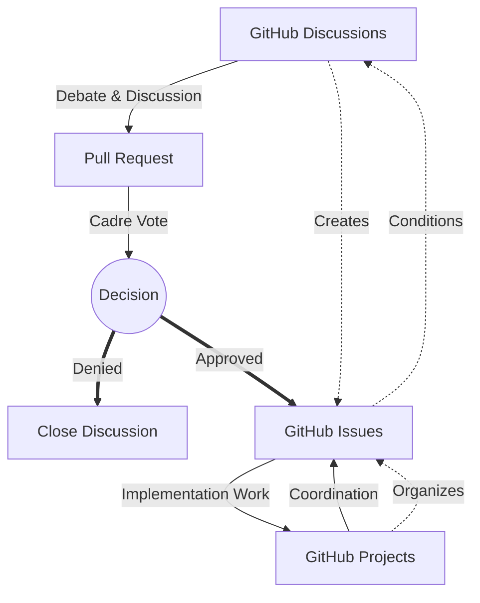

# KSBC .github Repository

This repository houses the core components of the DRUIDS system, including:
- Obsidian vault configurations and content structure.
- Documentation templates and content.
- Workflow automation scripts.
- Guidelines for content creation, security, and collaboration.

The aim is to provide a secure, efficient, and ideologically coherent system for managing the KSBC's collective knowledge and operational documentation.

## Democratic Centralist Principles in DRUIDS

The DRUIDS system is designed to embody and support the democratic centralist principles of the KSBC.

**[Placeholder: Overview of Democratic Centralist Principles in DRUIDS]**
*(This section will detail how DRUIDS workflows, security measures, and collaborative tools are intended to support principles such as political unity, cadre development, criticism/self-criticism, and the Theory -> Plan -> Practice -> Summation cycle. Specific examples related to DRUIDS features will be added here.)*

## Repository Structure Overview

- **/content**: Contains the main documentation and content, organized by security tiers:
    - `content/L0_public/`: Publicly accessible materials.
    - `content/L1_candidate/`: Materials for candidates and administrative functions.
    - `content/L2_cadre/`: Restricted materials for cadre members.
- **/.github**: Contains issue templates, pull request templates, and (eventually) GitHub Actions workflows.
- **/.obsidian**: (To be created) Will contain Obsidian-specific configuration files for vault setup, plugins, themes, etc.
- **/templates**: (To be created) Will house document templates for use with Obsidian's Templater plugin.
- `OBSIDIAN_INTEGRATION_GUIDE.md`: Comprehensive guide for setting up and using Obsidian with this system.

### Directory Mapping

```text
.github/
├── ISSUE_TEMPLATE/                    🟨
│   ├── config.yml                        # Issue template configuration
│   ├── proposal-template.md              # Template for proposal issues
│   ├── implementation-template.md        # Template for implementation issues
│   ├── documentation-template.md         # Template for documentation issues
│   ├── criticism-template.md             # Template for criticism issues
│   └── security-report-template.md       # Template for security reports
│
├── PULL_REQUEST_TEMPLATE/
│   ├── proposal-pr.md                          # PR template for proposals
│   ├── implementation-pr.md                    # PR template for implementation
│   └── documentation-pr.md                     # PR template for documentation
│
├── workflows/
│   ├── security-validation.yml                 # Security classification validation
│   ├── metadata-validation.yml                 # Frontmatter metadata validation
│   ├── issue-to-obsidian.yml                   # Sync issues to Obsidian vault
│   ├── branch-creation.yml                     # Democratic proposal branching
│   ├── documentation-deploy.yml                # Documentation deployment
│   ├── decision-implementation.yml             # Tracking implemented decisions
│   └── security-audit.yml                      # Regular security audits
│
├── CODEOWNERS                                  # Defines ownership for democratic review
│
├── CODE_OF_CONDUCT.md                          # Organizational code of conduct
│
├── CONTRIBUTING.md                             # Detailed contribution guidelines
│
├── GOVERNANCE.md                               # Democratic centralist governance model
│
├── SECURITY.md                                 # Security classification information
│
├── TEMPLATES/                                  # General templates for the organization
│   ├── document-template.md                    # Standard document template
│   ├── meeting-minutes-template.md             # Template for meeting minutes
│   ├── decision-record-template.md             # Template for recording decisions
│   └── criticism-session-template.md           # Template for criticism sessions
│
├── FUNDING.yml                                 # Sponsorship information if applicable
│
├── profile/                                    # Organization profile
│   └── README.md                               # Organization profile README (public)
│
└── README.md                                   # Main repository README
```

### GitHub Projects Board

+-------------------+---------------+----------------+------------------+
| Democratic        | Decision      | Unity of       | Evaluation       |
| Discussion        | Making        | Action         |                  |
+-------------------+---------------+----------------+------------------+
| • Theory debates  | • Consensus   | • Tasks being  | • Completed work |
| • Study materials | formation     | implemented    | • CSC process    |
| • Investigations  | • Voting      | • Assignments  | • Lessons learned|
+-------------------+---------------+----------------+------------------+

### WORKFLOW



## Getting Started

1.  **Clone the repository:** `git clone <repository_url>`
2.  **Review the `OBSIDIAN_INTEGRATION_GUIDE.md`:** This guide provides detailed instructions on setting up your Obsidian environment to work with DRUIDS.
3.  **Explore the `/content` directory:** Familiarize yourself with the security tier structure.
4.  **Consult `CONTRIBUTING.md`:** For guidelines on how to contribute to the project.

## Contribution

Contributions to DRUIDS are welcome and vital for its development. Please see `CONTRIBUTING.md` for detailed information on the contribution process, coding standards, and democratic centralist workflow.

## License

**[Placeholder: License Information]**
*(The KSBC team will determine and add the appropriate license for this project, e.g., MIT, GPL, CC-BY-SA, etc.)*

---

*This README is a living document and will evolve as the DRUIDS project progresses.*