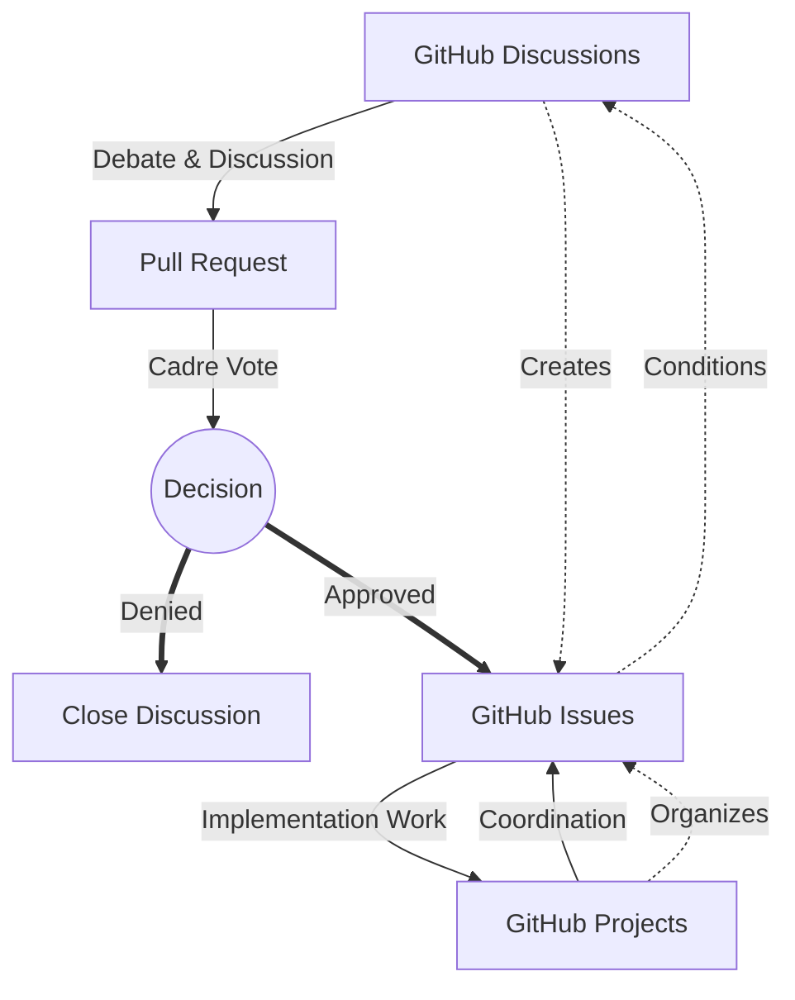

# Github Configurations Repo

##Directory Mapping

```text
.github/
├── ISSUE_TEMPLATE/                    🟨
│   ├── config.yml                        # Issue template configuration
│   ├── proposal-template.md              # Template for proposal issues
│   ├── implementation-template.md        # Template for implementation issues
│   ├── documentation-template.md         # Template for documentation issues
│   ├── criticism-template.md             # Template for criticism issues
│   └── security-report-template.md       # Template for security reports
│
├── PULL_REQUEST_TEMPLATE/            🟥
│   ├── proposal-pr.md                    # PR template for proposals
│   ├── implementation-pr.md              # PR template for implementation
│   └── documentation-pr.md               # PR template for documentation
│
├── workflows/                        🟨
│   ├── security-validation.yml               # Security classification validation
│   ├── metadata-validation.yml               # Frontmatter metadata validation
│   ├── issue-to-obsidian.yml                 # Sync issues to Obsidian vault
│   ├── branch-creation.yml                   # Democratic proposal branching
│   ├── documentation-deploy.yml              # Documentation deployment
│   ├── decision-implementation.yml           # Tracking implemented decisions
│   └── security-audit.yml                    # Regular security audits
│
├── CODEOWNERS                           🟥     # Defines ownership for democratic review
│
├── CODE_OF_CONDUCT.md                   🟥     # Organizational code of conduct
│
├── CONTRIBUTING.md                      🟥     # Detailed contribution guidelines
│
├── GOVERNANCE.md                        🟥     # Democratic centralist governance model
│
├── SECURITY.md                          🟨     # Security classification information
│
├── TEMPLATES/                            # General templates for the organization
│   ├── document-template.md              # Standard document template
│   ├── meeting-minutes-template.md       # Template for meeting minutes
│   ├── decision-record-template.md       # Template for recording decisions
│   └── criticism-session-template.md     # Template for criticism sessions
│
├── FUNDING.yml                          🟥 # Sponsorship information if applicable
│
├── profile/                              # Organization profile
│   └── README.md                        🟥     # Organization profile README (public)
│
└── README.md                            🟨     # Main repository README
```

## Implementation Guidance

### Issues

1. Create these files in each repository's `.github/ISSUE_TEMPLATE` directory    
2. Configure repository settings to:
    - Require templates for new issues
    - Enforce label requirements
    - Automate workflow progression
3. Maintain strict access controls per security level

### Pull Requests

coming soon

### 

### WORKFLOW


